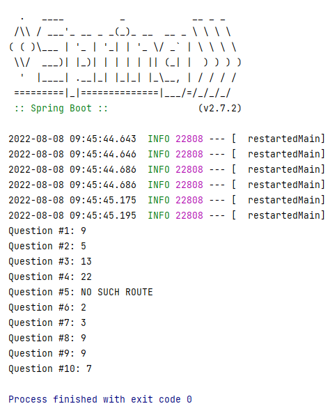

# PRUEBA TÉCNICA PARA FISA GROUP

> Prueba técnica para postulación a vacante en FISA GROUP.
> Consideraciones:

* Se seleccionó el primer ejercicio TRAINS
* Se creó un programa de consola usando el framework Spring Boot.
* El empaquetado final es JAR
* Se usaron algunos patrones de diseño


## Technologies Used
- Spring Boot.
- JUNIT para test.
- Variación del método DIJKSTRA para el cálculo de camino más corto.  

## Estructura
Se separaron en capas según la siguiente estructura:
- Exception
  - Se creó una clase básica para controlar las excepciones. 
- Model
  - Contiene los modelos Route, SubRoute y Town.
  - SubRoute es una clase interna que ayuda en el cálculo de los recorridos. 
- Service
  - Contiene los servicios que realizan los cálculos y utilidades para el programa.
- Question
  - Contiene la clase abstracta Question que abstrae métodos para calcular y extiende el método para imprimir el resultado.
  - Por cada pregunta del ejercicio se creó una clase que extiende de la clase abstracta Question, esto facilita en la reutilización de código. 
- Test
  - Contiene las pruebas de cada Question dentro de QuestionTest.java


## Requisitos
- Java 17
- Maven 3

## Instalación
- Descargar el código fuente o clonarlo desde Github 
```
git clone https://github.com/danygancino/TechnicalTest.git
```
- Descomprimir


## Compilar y empaquetar

```
cd technicalTest/
mvn clean
mvn package/
```

##Ejecutar
```
java -jar target/technicalTest-0.0.1-SNAPSHOT.jar
```

## Screenshots



## Descripción del ejercicio resuelto

PROBLEM ONE: TRAINS

Problem:  The local commuter railroad services a number of towns in Kiwiland.  Because of monetary concerns, all of the tracks are 'one-way.'  That is, a route from Kaitaia to Invercargill does not imply the existence of a route from Invercargill to Kaitaia.  In fact, even if both of these routes do happen to exist, they are distinct and are not necessarily the same distance!

The purpose of this problem is to help the railroad provide its customers with information about the routes.  In particular, you will compute the distance along a certain route, the number of different routes between two towns, and the shortest route between two towns.

Input:  A directed graph where a node represents a town and an edge represents a route between two towns.  The weighting of the edge represents the distance between the two towns.  A given route will never appear more than once, and for a given route, the starting and ending town will not be the same town.

Output: For test input 1 through 5, if no such route exists, output 'NO SUCH ROUTE'.  Otherwise, follow the route as given; do not make any extra stops!  For example, the first problem means to start at city A, then travel directly to city B (a distance of 5), then directly to city C (a distance of 4).

1. The distance of the route A-B-C.
2. The distance of the route A-D.
3. The distance of the route A-D-C.
4. The distance of the route A-E-B-C-D.
5. The distance of the route A-E-D.
6. The number of trips starting at C and ending at C with a maximum of 3 stops.  In the sample data below, there are two such trips: C-D-C (2 stops). and C-E-B-C (3 stops).
7. The number of trips starting at A and ending at C with exactly 4 stops.  In the sample data below, there are three such trips: A to C (via B,C,D); A to C (via D,C,D); and A to C (via D,E,B).
8. The length of the shortest route (in terms of distance to travel) from A to C.
9. The length of the shortest route (in terms of distance to travel) from B to B.
10. The number of different routes from C to C with a distance of less than 30.  In the sample data, the trips are: CDC, CEBC, CEBCDC, CDCEBC, CDEBC, CEBCEBC, CEBCEBCEBC.

```
Test input:


For the test input, the towns are named using the first few letters of the alphabet from A to D.  
A route between two towns (A to B) with a distance of 5 is represented as AB5.

Graph: AB5, BC4, CD8, DC8, DE6, AD5, CE2, EB3, AE7
```

```
Expected Output:

Output #1: 9
Output #2: 5
Output #3: 13
Output #4: 22
Output #5: NO SUCH ROUTE
Output #6: 2
Output #7: 3
Output #8: 9
Output #9: 9
Output #10: 7
```

---


## Contacto
- Por correo <a href="mailto:danygancino@gmail.com">danygancino@gmail.com</a> 

- Por Github [Dany Gancino](https://github.com/danygancino/) Agosto 2022
